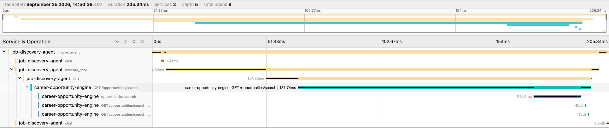

# JobDiscoveryAgent


JobDiscoveryAgent is a LangGraph-based AI agent for discovering relevant job
opportunities. The LLM decides when to invoke the `search_jobs` tool, which
queries [CareerOpportunityEngine](https://github.com/Sajjad-rafiee/CareerOpportunityEngine)
through its HTTP API. The agent generates responses grounded only in the
returned job data — it never invents postings.

## Architecture

```text
User
  ↓
JobDiscoveryAgent CLI
  ↓
invoke_agent()
  ↓
LangGraph
  ↓
Gemini / OpenAI
  ↓
search_jobs
  ↓
CareerOpportunityEngine
  ↓
HTTP API
  ↓
Job search
  ↓
ToolMessage
  ↓
LLM
  ↓
Final grounded response
```

**JobDiscoveryAgent** is the AI agent/orchestration layer. It handles user
interaction, LLM reasoning, tool selection, and final response generation.

**CareerOpportunityEngine** is the separate backend responsible for job
ingestion, storage, embeddings, and search. JobDiscoveryAgent communicates
with it through HTTP — it holds no job data and performs no database/vector
search of its own.

### Example

When the user asks:

> Find AI Engineer jobs in Berlin.

the LLM can invoke:

```text
search_jobs(query="AI Engineer", location="Berlin")
```

The tool folds the location into the backend search text and calls:

```text
GET /opportunities/search?q=AI+Engineer+Berlin&limit=10
```

CareerOpportunityEngine performs the actual job search and returns the
matching opportunities. The result is passed back to the LLM, which produces
the final grounded answer.

## Running it

```bash
uv sync
cp .env.example .env
```

Configure `MODEL_PROVIDER` and the corresponding provider key in `.env`. For
live job search (instead of offline demo data), also configure:

```text
CAREER_API_MODE=http
CAREER_API_BASE_URL=http://localhost:8000
CAREER_API_SEARCH_PATH=/opportunities/search
```

Then run:

```bash
uv run python -m agent.cli "Find AI Engineer jobs in Berlin."
```

Or interactively:

```bash
uv run python -m agent.cli
```

## Testing

```bash
uv run pytest
```

Runs the offline test suite without network access or external API calls.

```bash
uv run pytest -m integration
```

Runs integration tests against a running CareerOpportunityEngine backend.

The current test suite includes:

- 148 offline/unit tests for JobDiscoveryAgent
- 4 integration tests for the CareerOpportunityEngine integration

## Live Agent Demo

```bash
uv run python scripts/demo_agent.py "Find AI Engineer jobs in Berlin."
```

Execution flow:

```text
User
→ LLM
→ search_jobs
→ CareerOpportunityEngine
→ ToolMessage
→ LLM
→ final grounded answer
```

The agent has been verified end-to-end against the real CareerOpportunityEngine
backend. See [the captured demo run](docs/demo/agent-run.md) for an example
using real backend data. The live demo can also be inspected through the
distributed trace when the local Jaeger stack is enabled (see Observability
below).

## Observability

JobDiscoveryAgent uses OpenTelemetry for distributed tracing across the agent
and CareerOpportunityEngine. Off by default (`OTEL_TRACES_EXPORTER=none`);
local traces can be viewed in Jaeger.

A single trace can follow:

```text
User request
→ JobDiscoveryAgent
→ LLM
→ search_jobs
→ HTTPX
→ CareerOpportunityEngine
→ backend search
→ ToolMessage
→ final LLM response
```

The HTTP boundary propagates W3C Trace Context, allowing the Agent and
backend spans to appear in the same distributed trace:

```text
invoke_agent
├── chat
├── execute_tool: search_jobs
│   └── HTTP GET /opportunities/search
│       └── CareerOpportunityEngine
│           └── opportunities.search
└── chat
```

(Conceptual hierarchy — exact span names come from each library's own
instrumentation and may vary slightly.)



A real distributed trace in Jaeger: one trace ID, two services
(`job-discovery-agent` and `career-opportunity-engine`), spanning
`invoke_agent` down through the HTTP call into the backend's own
`opportunities.search` span. See
[`docs/observability.md`](docs/observability.md) for the equivalent trace
under a controlled backend failure.

### Failure tracing

The distributed trace was also verified against a controlled backend
failure. A real HTTP 503 propagated through the tool and backend layers and
remained visible in the same distributed trace. This makes it possible to
distinguish failures in the agent/tool layer from failures at the
HTTP/backend layer — it does not mean the agent is failure-proof.

### Two services, one trace

```text
JobDiscoveryAgent
        │
        │ HTTP + W3C Trace Context
        ▼
CareerOpportunityEngine
        │
        ▼
      Jaeger
```

The Agent and backend remain separate repositories and services.
OpenTelemetry propagates the trace context across the HTTP boundary so a
request can be followed as one distributed trace — they are not one
application package.

Telemetry is intentionally limited to operational metadata such as service,
model, tool, result count, status, and timing. Full prompts, job
descriptions, API keys, authorization headers, and full payloads are not
recorded as trace attributes.

For the full observability setup, trace structure, security considerations,
and local Jaeger instructions, see
[`docs/observability.md`](docs/observability.md).

## Project Status

JobDiscoveryAgent currently supports:

- LangGraph-based agent orchestration
- Gemini and OpenAI chat model providers
- tool calling through `search_jobs`
- CareerOpportunityEngine HTTP integration
- CLI interaction
- unit and integration tests
- real end-to-end verification
- OpenTelemetry-based distributed tracing
- Jaeger-based local trace visualization
- W3C trace context propagation across the Agent/backend boundary

This is a portfolio/demo project, not a production service.

## Related Project

[CareerOpportunityEngine](https://github.com/Sajjad-rafiee/CareerOpportunityEngine)
is the backend job-ingestion and search service used by JobDiscoveryAgent.

## License

MIT License. See [LICENSE](LICENSE).
