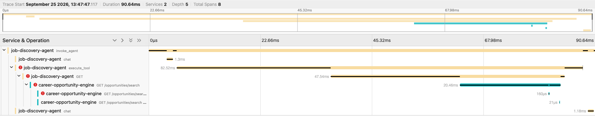

# Distributed Tracing

## Why

JobDiscoveryAgent and CareerOpportunityEngine are two separate services that
talk over HTTP. Without tracing, a slow or failed job search looks like two
disconnected problems — "the agent was slow" in one service's logs, "a
request took long" in the other's — with nothing linking them. Distributed
tracing gives one trace ID that follows a single user request across both
services, so the actual data flow (agent reasoning → tool call → HTTP → DB
search → HTTP → agent's final answer) is observable end to end.

This makes the data flow observable — it does not by itself prove the final
answer is grounded in real data; that is a separate concern (the system
prompt and formatting logic already constrain the agent to only state what
the tool returned, per its own tests).

## Architecture

```text
User
  ↓
JobDiscoveryAgent CLI
  ↓
invoke_agent()
  ↓
LangGraph
  ↓
Gemini / OpenAI
  ↓
search_jobs
  ↓
CareerOpportunityEngine
  ↓
HTTP API
  ↓
Job search
  ↓
ToolMessage
  ↓
LLM
  ↓
Final grounded response
```

Two independent processes, two independent OpenTelemetry SDKs, one shared
trace because the HTTP request between them carries a W3C `traceparent`
header.

## Service boundaries

- **`job-discovery-agent`** (this repo): spans for `invoke_agent`, `chat`
  (one per model call), and `execute_tool` (the `search_jobs` tool call).
- **`career-opportunity-engine`**: an HTTP server span per request
  (auto-created by FastAPI instrumentation) and a child `opportunities.search`
  span around the actual pgvector query.

## OpenTelemetry

Both services use the OpenTelemetry Python SDK directly (`TracerProvider` +
`BatchSpanProcessor` + OTLP HTTP exporter), each behind a small
`init_telemetry()` / `setup_telemetry()` function
(`utils/telemetry.py` here, `app/core/telemetry.py` in the backend) that is a
**no-op unless `OTEL_TRACES_EXPORTER=otlp`**. When it's a no-op, spans still
get created (the code always calls `tracer.start_as_current_span(...)`), but
they use the OpenTelemetry API's default no-op tracer — no exporter, no
network calls, no Jaeger dependency. That's what keeps both applications, and
their full test suites, working exactly as before with tracing off — the
default.

The `invoke_agent`/`execute_tool` span/attribute names follow OpenTelemetry's
GenAI semantic conventions (`gen_ai.operation.name`, `gen_ai.provider.name`,
`gen_ai.request.model`). **These conventions are currently at Development
stability** in the OpenTelemetry specification, not finalized/stable — they
are used here because they are the closest standard vocabulary available, not
as a claim of stability.

## W3C trace propagation

No custom propagation code exists in either service. OpenTelemetry Python's
default global propagator is already the W3C TraceContext + Baggage
composite, so:

- the agent's HTTPX instrumentation automatically attaches a `traceparent`
  header to the outbound request to CareerOpportunityEngine;
- the backend's FastAPI/ASGI instrumentation automatically extracts that
  header and continues the same trace.

`OTEL_PROPAGATORS=tracecontext,baggage` is set explicitly in both
`.env.example` files for clarity, but it matches the SDK default already in
effect even if unset.

## HTTPX instrumentation (agent side)

`opentelemetry-instrumentation-httpx`'s `HTTPXClientInstrumentor` is
instrumented once, globally, inside `init_telemetry()`. It wraps httpx's real
transport classes (`HTTPTransport`/`AsyncHTTPTransport`), so it transparently
instruments `CareerSearchClient`'s existing `httpx.Client` — no changes to
`api/client.py` were needed. It does **not** wrap `httpx.MockTransport`
(used by the unit tests), which is why the unit test for this instrumentation
uses a real local HTTP server instead.

## FastAPI instrumentation (backend side)

`opentelemetry-instrumentation-fastapi`'s `FastAPIInstrumentor.instrument_app(app)`
is called once, on the specific `app` instance, inside `setup_telemetry()`.
It creates the HTTP server span per request and is what extracts the incoming
`traceparent`.

## Jaeger

A local, disposable Jaeger all-in-one instance, run via
`docker-compose.observability.yml` in this repo (kept separate from
CareerOpportunityEngine's own `docker-compose.yml` so neither app's stack
depends on it):

```bash
docker compose -f docker-compose.observability.yml up -d
```

Exposes:

- `16686` — Jaeger UI (`http://localhost:16686`)
- `4317` — OTLP gRPC
- `4318` — OTLP HTTP (what both services use here)

**Networking note:** a process on the host (e.g. JobDiscoveryAgent run via
`uv run`) reaches Jaeger at `http://localhost:4318`. CareerOpportunityEngine's
`app` container is a different network namespace — inside it, "localhost"
means the container itself, not the host. Its `docker-compose.yml` therefore
defaults `OTEL_EXPORTER_OTLP_ENDPOINT` to `http://host.docker.internal:4318`
and adds `extra_hosts: host.docker.internal:host-gateway` so that hostname
resolves on Linux too (Docker Desktop on macOS/Windows provides it
automatically). This is exactly the kind of host-vs-container difference that
silently breaks a trace if you assume "localhost" works the same everywhere.

## What is deliberately NOT captured

No span in either service records:

- the user's prompt or any message content;
- the system prompt;
- the full LLM response;
- full tool output / full search results (only `result.count`);
- job titles or descriptions;
- API keys, authorization headers, or database credentials;
- raw SQL or embedding vectors.

OpenTelemetry's GenAI conventions explicitly allow capturing full
prompt/completion content as an opt-in feature — this project deliberately
never enables that. Spans carry metadata only: operation name, provider,
model name, tool name, call status, result counts, and standard HTTP
attributes (method, URL, status code, duration). This is verified by an
automated test (`tests/test_telemetry.py::test_no_span_attribute_contains_sensitive_payloads`)
that runs a request containing marker strings through the whole agent+tool
path and asserts none of those markers appear in any recorded span attribute.

## Running the local stack and reproducing a trace

```bash
# 1. Start Jaeger
cd JobDiscoveryAgent
docker compose -f docker-compose.observability.yml up -d

# 2. Start CareerOpportunityEngine with tracing on
cd ../CareerOpportunityEngine
OTEL_TRACES_EXPORTER=otlp docker compose up -d --build

# 3. Run the agent with tracing on (does not require rebuilding anything)
cd ../JobDiscoveryAgent
OTEL_TRACES_EXPORTER=otlp uv run python -m agent.cli "Find AI Engineer jobs in Berlin."

# 4. Open the trace
open http://localhost:16686
```

Search for service `job-discovery-agent`, operation `invoke_agent`. The trace
should contain spans from both `job-discovery-agent` and
`career-opportunity-engine` under one trace ID.

## Reproducing the controlled failure/latency scenario

CareerOpportunityEngine supports local-only fault injection via
`OTEL_DEMO_FAULT_MODE`, off by default:

```bash
# A ~2s delay before the search runs — shows up as backend latency in the trace
OTEL_DEMO_FAULT_MODE=delay OTEL_TRACES_EXPORTER=otlp docker compose up -d --build

# A 503 instead of a real search — shows up as a failed span/HTTP error
OTEL_DEMO_FAULT_MODE=error OTEL_TRACES_EXPORTER=otlp docker compose up -d --build
```

Then repeat the CLI run above and inspect the resulting trace in Jaeger — the
delay/error is real (it comes from an actual request that actually took that
long or actually failed), not a fabricated trace.

## Verified

Both scenarios below were captured from real runs against a live
CareerOpportunityEngine (Postgres + real N26 job data) and a live local
Jaeger, queried through Jaeger's HTTP API (`/api/traces`) to confirm the
trace structure programmatically, not just by eye.

**Happy path** — trace `a4dd8f64b35388b91c4ac7dcf4e9f5c3`, 9 spans across
both services, real search returning 10 real opportunities:

```text
[job-discovery-agent]        invoke_agent                          (root)
[job-discovery-agent]          chat
[job-discovery-agent]          execute_tool
[job-discovery-agent]            GET                                  ← HTTPX client span
[career-opportunity-engine]        GET /opportunities/search           ← FastAPI server span,
[career-opportunity-engine]          opportunities.search                child of the span above
[career-opportunity-engine]          GET /opportunities/search http send (x2, ASGI response events)
[job-discovery-agent]          chat
```

The backend's server span being a direct child of the agent's HTTPX client
span is the trace-level proof that the W3C `traceparent` header was actually
received and honored across the process boundary — this parent/child link
cannot happen by coincidence between two independently-initialized
OpenTelemetry SDKs in two separate processes.

**Failure path** — trace `07aa596dbd3b32eec02aeab0181cca8d`, captured with
`OTEL_DEMO_FAULT_MODE=error`: the same hierarchy, but `execute_tool`, the
HTTPX `GET` span, and both backend HTTP spans are all marked
`error=true`/`http.status_code=503`, and the tool correctly turns that into
`tool.call.status=error` rather than fabricating a result.



This is the controlled backend failure scenario (`OTEL_DEMO_FAULT_MODE=error`):
the red error markers appear on `execute_tool`, the HTTPX client span, and
both `career-opportunity-engine` spans, but the trace itself is unbroken —
both services remain visible in the same distributed trace, which is what
makes it possible to tell a real backend failure apart from an agent-side
one instead of just seeing two disconnected symptoms.

Every attribute recorded on every span in both traces was inspected directly
via the Jaeger API: only operation names, provider/model names, tool
name/status, result counts, and standard HTTP metadata (method, URL, status
code, host, user agent) — no prompts, no job descriptions, no keys.
